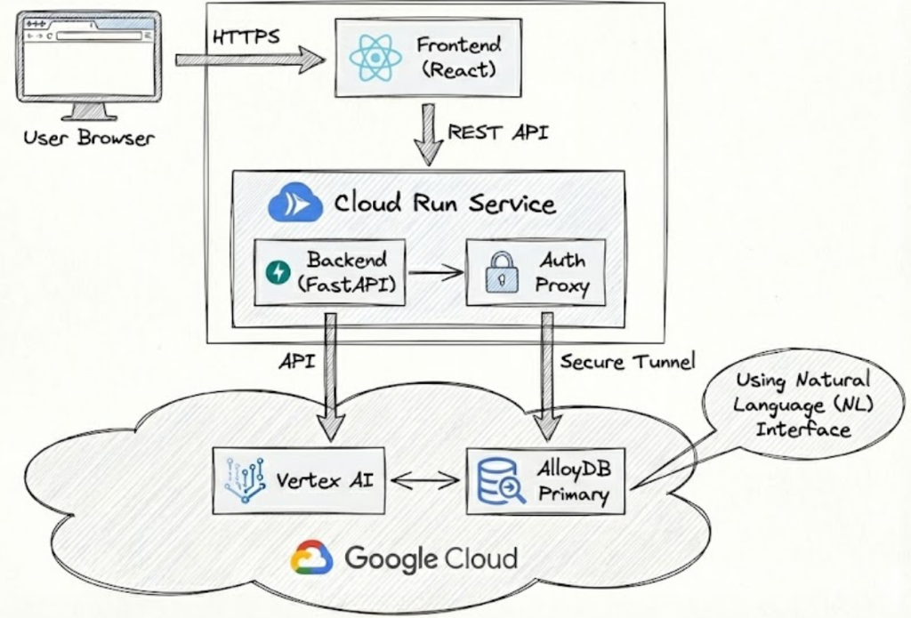

# AlloyDB AI Search Demo

This project is a full-stack demonstration of how to build a modern, AI-powered search application using Google Cloud's **AlloyDB for PostgreSQL**, **Vertex AI** & **Vertex AI Search**.

It showcases four distinct search methodologies enabled by moving AI logic closer to your data, allowing users to interact with a property listing database in intuitive and powerful ways.

Check out AlloyDB AI NL https://docs.cloud.google.com/alloydb/docs/ai/natural-language-landing

Disclaimer: Readme.md generated by Gemini

## Features: The 4 Modes of Search

| Mode | User Intent | Technology Stack | How it Works |
| :--- | :--- | :--- | :--- |
| **NL2SQL (Generative SQL)** | "I have specific, complex criteria." | **AlloyDB AI** (`alloydb_ai_nl` extension) | Converts natural language queries (e.g., "3-bed in Geneva under 6k") directly into a precise SQL `WHERE` clause inside the database. |
| **Semantic Search** | "I'm searching by concept or vibe." | **AlloyDB** (`pgvector`) + **Vertex AI** (Text Embeddings) | Converts user query into a vector, finding property descriptions with the closest semantic meaning, matching concepts over keywords. |
| **Visual Search** | "I know the look I want." | **AlloyDB** (`pgvector`) + **Vertex AI** (Multimodal Embeddings) | Converts user text into a "visual vector" and searches against vectors generated from property images, finding aesthetic matches. |
| **Managed Search** | "I want Google-quality search." | **Vertex AI Search** (Agent Builder) | A fully managed "Search as a Service" that ingests data and provides a pre-tuned API with ranking, typo-tolerance, and hybrid search out-of-the-box. |

## Architecture Overview

This application follows a modern, containerized microservices architecture designed for scalability and security.

### System Components
1.  **Frontend (React + Vite)**: Serves the user interface and communicates with the backend via REST API.
2.  **Backend (FastAPI)**: Handles application logic, orchestrates AI services, and connects to the database.
3.  **AlloyDB Auth Proxy**: A sidecar process that manages secure, encrypted connections to AlloyDB, eliminating the need for handling static database credentials.
4.  **AlloyDB for PostgreSQL**: The primary relational database, enhanced with `pgvector` for semantic search and `alloydb_ai_nl` for natural language to SQL translation.
5.  **Vertex AI**: Provides the AI models for embeddings (text & multimodal) and the fully managed search engine.



### User Interface
The interface is designed to be intuitive, offering four distinct search modes to cater to different user needs.


## Technical Architecture
* **Frontend:** React + Vite (Containerized with Nginx)
* **Backend:** FastAPI (Containerized with Python 3.11)
* **Database:** AlloyDB for PostgreSQL (with `alloydb_ai_nl` and `vector` extensions)
* **AI Services:** Vertex AI (Embeddings, Multimodal, Search)

## Getting Started

### Prerequisites

#### Tools
* **Google Cloud SDK (`gcloud`)**: Installed and authenticated.
* **Docker**: Installed (for local debugging and building).
* **Git**: For version control.

#### IAM Permissions
To successfully deploy and run this application, specific IAM roles are required for both the **User (Deployer)** and the **Cloud Run Service Account**.

**1. User (Deployer) Permissions:**
You need these permissions to build images and deploy services:
* `roles/owner` OR `roles/editor` (Broad access)
* OR specifically:
    * `roles/artifactregistry.writer` (To push Docker images)
    * `roles/run.admin` (To deploy Cloud Run services)
    * `roles/iam.serviceAccountUser` (To act as the service account)

**2. Cloud Run Service Account Permissions:**
The identity running the Cloud Run service is now a **Dedicated Service Account** (`search-backend-sa`), not the default Compute SA. It needs:
* `roles/alloydb.client`: To connect to AlloyDB.
* `roles/discoveryengine.editor`: To query Vertex AI Search.
* `roles/logging.logWriter`: To write logs to Cloud Logging.
* `roles/serviceusage.serviceUsageConsumer`: To consume Google Cloud APIs.
* `roles/aiplatform.user`: To use Vertex AI Embeddings.
* `roles/datastore.user`: For Vertex AI Search data access.


### Connectivity & AlloyDB Auth Proxy
This application uses the **AlloyDB Auth Proxy** pattern to securely connect to the database.

#### Private IP (Default)
The AlloyDB instance is configured with **Private IP only** for enhanced security.
* **Cloud Run**: Connects via **Direct VPC Egress** to the `search-demo-vpc`.
* **Local Debugging**: Uses a **Bastion Host** (`search-demo-bastion`) to tunnel connections to the private database.


### Database & AI Setup

#### 1. AlloyDB Setup
You must provision an AlloyDB for PostgreSQL instance and run the provided initialization scripts to create the schema and enable extensions.

1.  **Create AlloyDB Cluster & Instance**: Ensure it is in the same region as your Cloud Run services.
2.  **Run SQL Scripts**: Connect to your instance (e.g., via AlloyDB Studio or `psql` through the proxy) and execute the scripts in `alloydb artefacts/`:
    *   `alloydb_setup.sql`: Creates the `search` schema, tables, and enables `pgvector`.
    *   `alloydb_ai_nl_setup.sql`: Configures the `alloydb_ai_nl` extension for Natural Language to SQL.
    
    
    
    **Alternative: Terraform Setup (Recommended)**
    You can provision the entire infrastructure (Project, AlloyDB, Vertex AI, GCS, IAM) using Terraform.
    
    1.  Navigate to `terraform/`:
        ```bash
        cd terraform
        ```
    2.  Create `terraform.tfvars` with your project details (see `terraform.tfvars.example`).
    3.  Run Terraform:
        ```bash
        terraform init
        terraform apply
        ```
    4.  Generate `.env` file:
        ```bash
        ./generate_env.sh
        ```

#### 2. Visual Search Setup (Optional)
To enable Visual Search, you need to populate the database with images and embeddings. We provide a bootstrap script for this.

1.  **Prerequisites**:
    *   A Google Cloud Storage bucket to store generated images.
    *   Vertex AI Vision API enabled.
2.  **Run the Bootstrap Script**:
    This script generates AI images for each listing, uploads them to GCS, calculates embeddings, and updates the database.
    ```bash
    # 1. Create a virtual environment
    python3 -m venv venv
    source venv/bin/activate
    
    # 2. Install dependencies
    pip install -r backend/requirements.txt
    
    # 3. Start AlloyDB Auth Proxy (via Bastion Tunnel)
    # The bootstrap script expects a local connection.
    # Use the debug_local.sh script's logic or manually tunnel:
    gcloud compute ssh search-demo-bastion --zone <REGION>-b -- -L 5432:127.0.0.1:5432
    # (Then run the proxy on the bastion or tunnel the proxy port)
    
    # EASIER: Just run ./debug_local.sh in one terminal to set up the tunnel, 
    # then run the bootstrap script in another.
    
    # 4. Run the script
    python alloydb\ artefacts/bootstrap_images.py
    ```
    *Note: This script assumes the AlloyDB Auth Proxy is running on `localhost:5432`.*


#### 3. Vertex AI Search Setup
For the "Managed Search" mode, you must set up a Vertex AI Search app.

1.  **Enable API**: Enable "Vertex AI Search and Conversation API".
2.  **Create App**: Create a new "Search" app in "Generic" mode.
    *   **Region**: Must be **Global**. Regional apps (e.g., `us`, `eu`) are not supported by this demo's default configuration.
3.  **Create Data Store**:
    *   Source: **AlloyDB for PostgreSQL** (Preview).
    *   Select your AlloyDB table (`search.property_listings`).
    *   **IMPORTANT**: Ensure all columns (title, description, price, city, etc.) are set to **Retrievable** and **Searchable** in the schema mapping configuration.
4.  **Link Data Store**: Connect the data store to your Search App.
5.  **Update Config**: Set the `VERTEX_SEARCH_DATA_STORE_ID` environment variable in `backend/service.yaml` and `.env` to your Data Store ID.

## Setup

> [!IMPORTANT]
> **Before you begin:** Please review the [Infrastructure Prerequisites](infrastructure_prerequisites.md) to ensure your Google Cloud environment (AlloyDB, IAM, etc.) is correctly configured.

1.  **Environment Configuration**:
    Copy the example environment file and update it with your configuration:
    ```bash
    ./setup_env.sh
    ```
    This script will prompt you for your Google Cloud Project ID, Region, AlloyDB details, and Vertex AI Search Data Store ID. It will generate a `backend/.env` file.

    Ensure all values are correct. You can use `example.env` as a reference.

### Local Debugging (Containerized)
To run the application locally in Docker containers (mimicking the Cloud Run environment):

```bash
./debug_local.sh
```
This will:
1. SSH into the **Bastion Host**.
2. Start the **AlloyDB Auth Proxy** on the Bastion.
3. Tunnel the connection to your local machine (`localhost:5432`).
4. Build and run the **Backend container** (connected to the tunnel).
5. Build and run the **Frontend container** (connected to the backend).
6. Access the app at `http://localhost:8081`.


### Deployment to Cloud Run
To deploy the full stack to Google Cloud Run:

```bash
./deploy.sh
```
This script will:
1. Check for necessary IAM permissions.
2. Build Docker images and push them to Artifact Registry.
3. Deploy the **Backend service** (with AlloyDB Auth Proxy sidecar).
4. Deploy the **Frontend service** (configured to talk to the Backend).
5. Output the public URLs for both services.

## Repository Structure
* `backend/`: FastAPI application and Dockerfile.
* `frontend/`: React application and Dockerfile.
* `deploy.sh`: Automated deployment script for Cloud Run.
* `debug_local.sh`: Script for local containerized debugging.
* `alloydb artefacts/`: SQL scripts for database setup.
